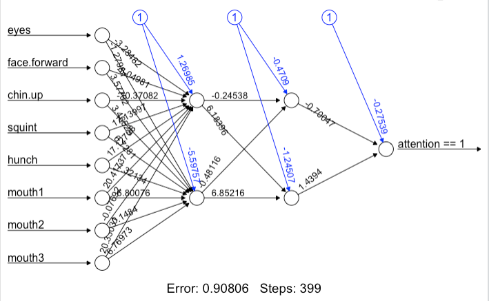
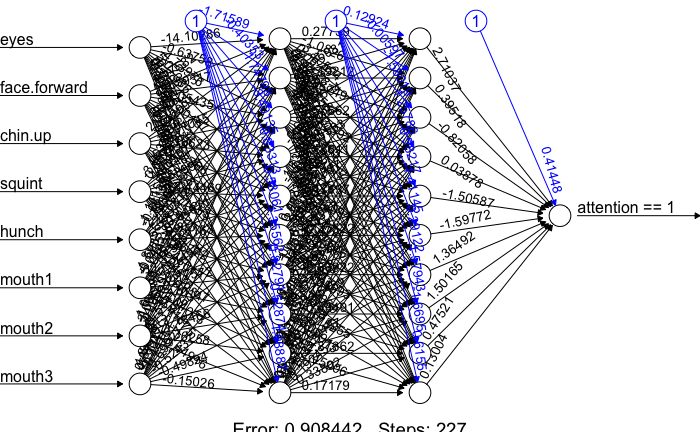

# Neural Networks

Neural networks are not a new method, the first artificial neural network was devised in 1943, but advances in computational power and speed have made them a much more viable strategy for solving complex problems over the last 5-10 years. Originally devised by mathmaticians and neuroscientists to illustrate the fundamental principles of how brains might work they lost favor in the second half of the 20th century only to surge in popularity in the 20-teens as software engineers used them to resolve mathmatically intractable problems. The application of neural networks to learning problems has been ongoing for 20 years, often to predict student behvior or to parse unstructured data such as student writing samples and provide natural sounding feedback through AI avatars.

## Goals for this project
The purpose of this project is to use artificial neural networks to solve two prediction problem (examples). The frist problem is to predict student attentional state from webcam images. 

## Procedure
* *Install packages*: Install and load the neuralnet package

* *Understand datasets*
  - The datasets are *attention1.csv* and *attention2.csv*, which can also be found in this github repository. The datasets are cleaned. 

  - In the attached data sets attention1.csv and attention2.csv, data describes features assocaited with webcam images of 100 students' faces as they particpate in an online discussion. The variables are:
    - eyes - student has their eyes open (1 = yes, 0 = no)
    - face.forward - student is facing the camera (1 = yes, 0 = no)
    - chin.up - student's chin is raised above 45 degrees (1 = yes, 0 = no)
    - squint - eyes are squinting
    - hunch - shoulders are hunched over
    - mouth1 - mouth is smiling
    - mouth2 - mouth is frowning
    - mouth3 - mouth is open
    - attention - whether the student was paying attention when asked (1 = yes, 0 = no)

  - Codes for turning into dataframe
  ```
  D1 <- read.csv("attention1.csv", header = TRUE)
  
  D2 <- read.csv("attention2.csv", header = TRUE)
  ```

* *Data Analysis*
  - Build a neural net that predicts attention based on webcam images. The command "neuralnet" sets up the model. 
  ```
  nn <- neuralnet(attention == 1 ~ eyes + face.forward + chin.up + squint + hunch + mouth1 + mouth2 + mouth3, D1, hidden = c(2,2), learningrate = 0.2)
  ```
  - Plot the neural networks.
  ```
  plot(nn)
  ```
  - Now, we can see the neural networks from the visualization.The plot shows the layers of the newtork as black nodes and edges with the calculated weights on each edge. The blue nodes and edges are the bias/threshold terms.
  
  
  - Use the neural net to predict the second data set (*attention2.csv*). Creating a new data frame (D3) that only includes the input layers.
  ```
  D3 <- D2[,-4]
  pred <- predict(nn, D3)
  ```
  - Calculate how accurate your model is at predicting the unseen data
  ```
  table(D2$attention == 1, pred[, 1] > 0.5)
  ```

  - Adjust both the hidden layer and lerarning rate and see if that has an impact on error, steps and prediction accuracy
  ```
  nn2 <- neuralnet(attention == 1 ~ eyes + face.forward + chin.up + squint + hunch + mouth1 + mouth2 + mouth3, D1, hidden = c(10,10), learningrate = 0.01)
plot(nn2)
  ```
   
  
  ```   
  pred <- predict(nn2, D3)
  table(D2$attention == 1, pred[, 1] > 0.5)
  ```

## Discovery
  - After increasing the number of hidden layers, the error increases a little bit, which shows that sometimes increasing layers doesn't have help to improve accuracy. According to the result matrix, the prediction accuracy remains no change through calculating. 
  
  
  